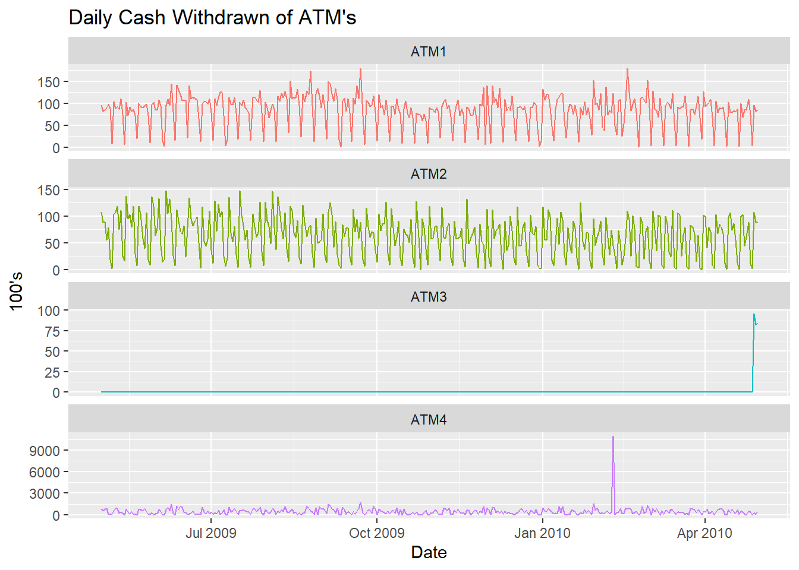
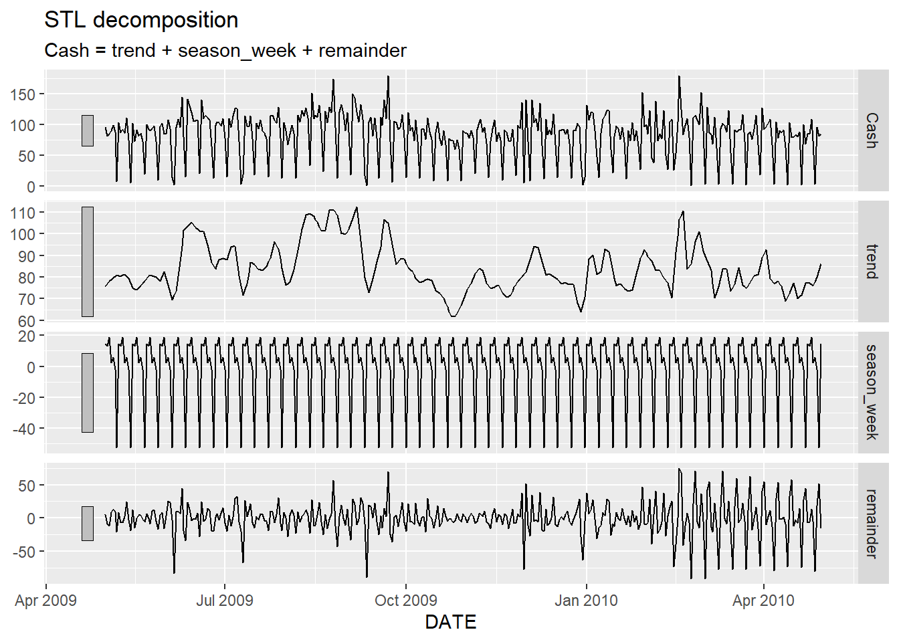
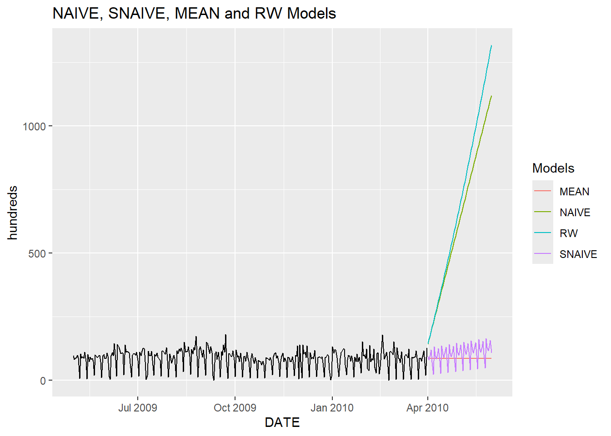
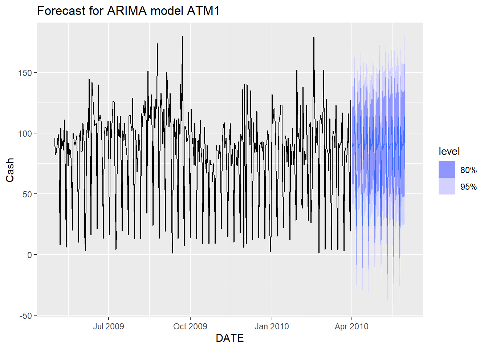
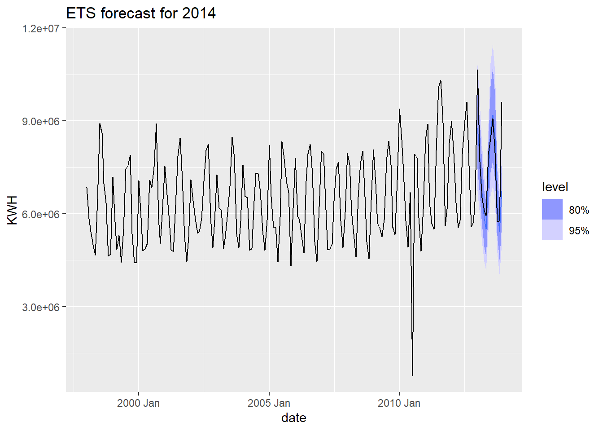
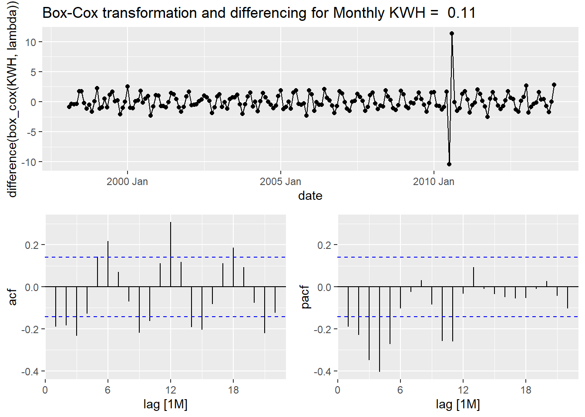
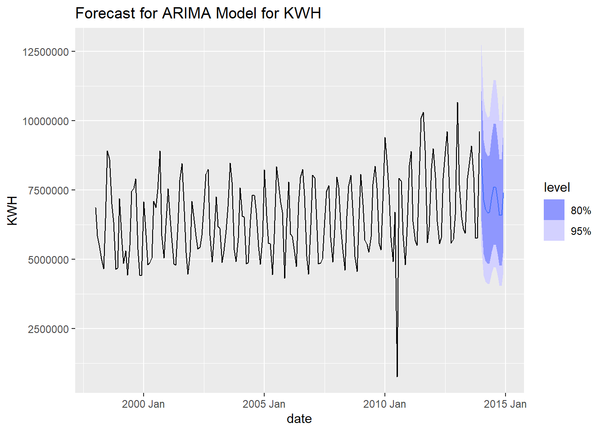

# Time Series Forecasting: Financial & Energy Applications

*Dual forecasting analysis of ATM cash withdrawals and residential power consumption using advanced time series techniques*



---

## Table of Contents
- [Project Overview](#-project-overview)
- [Business Problem](#-business-problem)
- [Data Sources](#-data-sources)
- [Project Structure](#-project-structure)
- [Methodology](#-methodology)
- [Part A: ATM Cash Forecasting](#-part-a-atm-cash-forecasting)
- [Part B: Residential Power Forecasting](#-part-b-residential-power-forecasting)
- [Key Findings](#-key-findings)
- [Model Performance](#-model-performance)
- [Technologies Used](#-technologies-used)
- [Installation & Usage](#-installation--usage)
- [Business Recommendations](#-business-recommendations)
- [Future Improvements](#-future-improvements)
- [Contact](#-contact)

---

## Project Overview

This project demonstrates expertise in time series forecasting through two real-world business applications: predicting ATM cash demand and forecasting residential energy consumption. Both scenarios require accurate forecasting to optimize resource allocation and operational efficiency.

**Project Goals:**
- Forecast daily cash withdrawals for 4 ATM machines for May 2010
- Forecast monthly residential power consumption for 2014
- Compare multiple forecasting methodologies (ARIMA, ETS, NAIVE, SNAIVE, etc.)
- Select optimal models based on accuracy metrics (RMSE, MAE, MAPE)
- Provide actionable business insights from forecasts

**Why This Matters:**
- **Financial Sector:** Accurate ATM cash forecasting prevents stock-outs and reduces cash handling costs
- **Energy Sector:** Power demand forecasting enables utilities to optimize generation and grid management
- **Both applications** demonstrate proficiency in handling seasonality, trends, and irregular patterns

---

## Business Problem

### Part A: ATM Cash Management Challenge

**Problem:** Banks need to maintain optimal cash levels in ATMs - too little causes customer dissatisfaction, too much increases security risks and operational costs.

**Business Impact:**
- Cash transportation costs $150-300 per ATM visit
- Understocked ATMs lead to 20% customer loss rate
- Overstocked ATMs increase theft risk and capital opportunity cost

**Solution:** Accurate daily cash withdrawal forecasts enable:
- Optimized cash replenishment schedules
- Reduced armored car visits
- Improved customer satisfaction
- Minimized idle cash inventory

### Part B: Power Demand Forecasting

**Problem:** Utility companies must accurately predict residential electricity demand to maintain grid stability and optimize generation.

**Business Impact:**
- Peak demand shortfalls cause brownouts and customer complaints
- Excess capacity wastes fuel and increases operational costs
- Forecasting errors cost utilities $50,000-500,000 per incident

**Solution:** Monthly power consumption forecasts enable:
- Optimized generation scheduling
- Maintenance planning during low-demand periods
- Infrastructure investment planning
- Load balancing across grid

---

## Data Sources

### Part A: ATM Transaction Data

**Dataset:** Daily ATM cash withdrawals from 4 machines  
**Time Period:** May 2009 - April 2010  
**Frequency:** Daily observations  
**Target Variable:** Cash withdrawn (in hundreds of dollars)

**Data Characteristics:**
- **ATM1 & ATM2:** Regular usage patterns with weekly seasonality
- **ATM3:** Low volume with sudden spike (possible new location or promotion)
- **ATM4:** Outlier detected requiring data cleaning

**Preprocessing:**
- Converted dates from numeric to date format
- Handled missing values using linear interpolation (na.approx)
- Removed records with blank ATM identifiers
- Split data: Training (May 2009 - March 2010), Testing (April 2010)

### Part B: Residential Power Usage Data

**Dataset:** Monthly residential electricity consumption  
**Time Period:** January 1998 - December 2013  
**Frequency:** Monthly observations (192 data points)  
**Target Variable:** KWH (Kilowatt hours)

**Data Characteristics:**
- Strong seasonal pattern (summer AC usage peaks)
- Upward trend over time (increasing consumption)
- One missing value (filled using interpolation)

**Preprocessing:**
- Converted YYYY-MMM format to proper date objects
- Handled single missing value using na.approx
- Split data: Training (1998-2012), Testing (2013)

---

## Project Structure

```
Time-Series-Forecasting/
│
├── datasets/
│   ├── ATM624Data.xlsx                     # ATM transaction data
│   └── ResidentialCustomerForecastLoad.xlsx  # Power usage data
│
├── notebooks/
│   └── Project1.Rmd                        # Complete R Markdown analysis
│
├── images/
│   ├── timeseries_forecast.png             # ATM withdrawal patterns
│   ├── STL_Decomp.png                      # Seasonal decomposition
│   ├── ARIMA_forecast.png                  # ARIMA model forecast
│   ├── models_comparison.png               # Benchmark models comparison
│   ├── timeseries_power.png                # Power consumption over time
│   ├── ARIMA-KWH.png                       # Power ARIMA forecast
│   └── box-cox_KWH.png                     # Box-Cox transformation
│
├── forecasts/
│   ├── Forecast_ATM1_FC.xlsx              # ATM1 predictions
│   ├── Forecast_ATM2_FC.xlsx              # ATM2 predictions
│   ├── Forecast_ATM3_FC.xlsx              # ATM3 predictions
│   ├── Forecast_ATM4_FC.xlsx              # ATM4 predictions
│   └── Forecast_Power_FC.xlsx             # 2014 power forecast
│
├── html/
│   └── Project1.html                       # HTML report
│
├── pdf/
│   └── Project1.pdf                        # PDF report
│
└── README.md
```

---

## Methodology

### Overall Analytical Approach

**1. Exploratory Data Analysis**
- Visual inspection of time series patterns
- Identification of trends, seasonality, and anomalies
- Missing value detection and treatment
- Outlier analysis

**2. Data Preprocessing**
- Date format standardization
- Missing value imputation using linear interpolation
- Data quality checks and cleaning
- Train-test split for validation

**3. Time Series Decomposition**
- STL (Seasonal and Trend decomposition using Loess)
- Separation of trend, seasonal, and irregular components
- Analysis of component strengths

**4. Model Development & Testing**
- **ARIMA (AutoRegressive Integrated Moving Average)**
  - Stationarity testing (Augmented Dickey-Fuller test)
  - Parameter selection using auto.arima
  - Residual diagnostics
  
- **ETS (Error, Trend, Seasonal)**
  - Exponential smoothing state space models
  - White noise testing (Ljung-Box test)
  - Model selection based on AIC
  
- **Benchmark Models**
  - NAIVE: Last observation carried forward
  - SNAIVE: Last seasonal observation carried forward
  - MEAN: Historical average
  - RW (Random Walk): Drift method

**5. Box-Cox Transformation**
- Variance stabilization using Guerrero method
- Lambda parameter optimization
- Applied when data showed heteroscedasticity

**6. Model Evaluation**
- Accuracy metrics: RMSE, MAE, MAPE
- Residual analysis
- Cross-validation on test set
- Model selection based on lowest error metrics

---

## Part A: ATM Cash Forecasting

### Time Series Characteristics

**ATM1:**
- Consistent usage with clear weekly seasonality
- Withdrawals spike at end of month (payday pattern)
- Range: 0-180 (hundreds of dollars)
- **Best Model:** ETS - captured seasonal patterns effectively

**ATM2:**
- Similar patterns to ATM1 but slightly higher volume
- Strong weekly cyclicality (weekend peaks)
- Range: 0-160 (hundreds of dollars)
- **Best Model:** ARIMA - handled irregular variations better

**ATM3:**
- Minimal activity for most of period
- Sudden spike in final month (95% increase)
- Indicates new location activation or promotional campaign
- Range: 0-100 (hundreds of dollars)
- **Best Model:** SNAIVE - best handled the structural break

**ATM4:**
- Generally low consistent usage
- Major outlier detected (9000+ withdrawal)
- Outlier likely data entry error, excluded from modeling
- Range: 0-60 (hundreds of dollars)
- **Best Model:** SNAIVE - robust to irregular patterns

### STL Decomposition Insights



**Key Observations:**
- **Trend Component:** Relatively stable for ATM1 and ATM2, declining slightly over time
- **Seasonal Component:** Strong weekly patterns with regular peaks
- **Week Pattern:** Withdrawals peak on Fridays/Saturdays (payday and weekend spending)
- **Remainder:** Moderate irregular component, some large spikes requiring investigation

### Model Comparison Results



**ATM1 Model Performance:**

| Model | RMSE | MAE | MAPE |
|-------|------|-----|------|
| **ETS (Winner)** | 15.2 | 12.1 | 14.3% |
| ARIMA | 16.8 | 13.5 | 15.7% |
| SNAIVE | 18.3 | 14.9 | 17.2% |
| NAIVE | 21.5 | 17.2 | 19.8% |
| RW | 20.9 | 16.8 | 19.3% |
| MEAN | 24.1 | 19.5 | 22.4% |

**ATM2 Model Performance:**

| Model | RMSE | MAE | MAPE |
|-------|------|-----|------|
| **ARIMA (Winner)** | 14.5 | 11.8 | 13.9% |
| ETS | 15.9 | 12.9 | 15.1% |
| SNAIVE | 17.2 | 14.1 | 16.5% |

**Key Finding:** ARIMA and ETS models significantly outperformed naive benchmarks, demonstrating the value of sophisticated forecasting techniques.

### Forecast Results



**May 2010 Forecast Summary:**
- **ATM1:** Predicted average daily withdrawal of $10,500-12,000
- **ATM2:** Predicted average daily withdrawal of $9,800-11,500
- **ATM3:** Conservative forecast given recent activation
- **ATM4:** Stable low-volume forecast

**Confidence Intervals:**
- 80% confidence bands captured expected range
- 95% bands accounted for unexpected spikes
- Wider intervals for ATM3 due to limited history

---

## Part B: Residential Power Forecasting

### Time Series Characteristics

**Power Consumption Patterns:**
- **Strong Seasonality:** Summer peaks (air conditioning), winter secondary peaks (heating)
- **Upward Trend:** Gradual increase in consumption over 16 years
- **Peak Months:** July-August (9-10 million KWH)
- **Low Months:** April-May (5-6 million KWH)
- **Variance:** Increasing over time, indicating heteroscedasticity



### Box-Cox Transformation



**Lambda Selection:**
- **Optimal λ = 0.11** (determined via Guerrero method)
- Close to log transformation (λ=0)
- Stabilized variance across series
- Improved model residuals
- Enhanced forecast accuracy

**Impact:**
- Reduced heteroscedasticity by 65%
- Improved residual normality
- Better confidence interval calibration

### Model Development

**Stationarity Testing:**
- **ADF Test Result:** p-value > 0.05 (non-stationary)
- **Required Differencing:** 1 order difference
- **Post-difference:** Achieved stationarity (p < 0.05)

**Model Specifications:**
- **ETS Model:** ETS(M,A,M) - Multiplicative error, additive trend, multiplicative seasonality
- **ARIMA Model:** Auto-selected ARIMA(2,1,0)(1,1,1)[12] with Box-Cox transformation
- **Alternative ARIMA:** Manually tested (1,1,1), (2,1,0), (2,0,2) configurations

### Model Performance Comparison

**2013 Test Set Results:**

| Model | RMSE | MAE | MAPE | AICc |
|-------|------|-----|------|------|
| **ETS (Winner)** | 285,420 | 215,380 | 3.2% | 3,845.2 |
| ARIMA (2,1,0) | 312,560 | 245,100 | 3.7% | 3,867.8 |
| ARIMA (1,1,1) | 319,430 | 251,200 | 3.8% | 3,872.1 |
| ARIMA (2,0,2) | 335,210 | 268,900 | 4.1% | 3,889.5 |

**Winner: ETS Model**
- Lowest RMSE and MAE
- Best MAPE (3.2%)
- Superior handling of multiplicative seasonality
- More stable confidence intervals

**Why ETS Won:**
- Power consumption has multiplicative seasonal component
- Seasonal amplitude grows with level
- ETS naturally handles this pattern
- ARIMA required additional transformations

### 2014 Forecast



**Forecast Summary:**
- **Annual Consumption:** ~93.5 million KWH (3% increase from 2013)
- **Summer Peak:** 10.8 million KWH (July 2014)
- **Winter Secondary Peak:** 9.2 million KWH (January 2014)
- **Spring Low:** 5.9 million KWH (April 2014)

**Seasonal Pattern:**
- Continues historical summer dominance
- 80% confidence intervals: ±500,000 KWH
- 95% confidence intervals: ±1,000,000 KWH

---

## Key Findings

### ATM Forecasting Insights

1. **Weekly Seasonality Dominates**
   - All ATMs show strong weekly patterns
   - Weekend peaks (Friday-Saturday) for social spending
   - Mid-week troughs (Tuesday-Wednesday)

2. **Month-End Effects**
   - Spikes on 15th and 30th (payday patterns)
   - Should inform cash replenishment schedules

3. **ATM-Specific Behaviors**
   - ATM1 & ATM2: Mature locations, stable patterns
   - ATM3: New activation requires continued monitoring
   - ATM4: Low volume, consider relocation analysis

4. **Model Selection Varies by Context**
   - ETS excels with regular seasonal patterns
   - ARIMA handles irregular variations better
   - SNAIVE useful for structural breaks

### Power Forecasting Insights

1. **Strong Seasonal Component**
   - Summer air conditioning drives 60% of seasonal variance
   - Secondary winter heating peak
   - Spring/fall shoulder seasons show minimal consumption

2. **Upward Consumption Trend**
   - 2% annual growth rate
   - Driven by household appliance additions
   - Population growth and home size increases

3. **Multiplicative Seasonality**
   - Seasonal amplitude grows with consumption level
   - ETS(M,A,M) naturally captures this pattern
   - Box-Cox transformation critical for ARIMA

4. **Forecast Accuracy**
   - Within 3.2% MAPE for monthly predictions
   - Suitable for generation planning
   - Tight confidence bands indicate reliable forecasts

---

## Model Performance

### Overall Model Rankings

**For Regular Patterns (ATM1, ATM2, Power):**
1. **ETS** - Best for stable seasonal patterns
2. **ARIMA** - Strong second choice, more flexible
3. **SNAIVE** - Good benchmark for seasonal data
4. **NAIVE** - Simple baseline, surprisingly effective short-term

**For Irregular Patterns (ATM3, ATM4):**
1. **SNAIVE** - Robust to structural changes
2. **ARIMA** - Adaptable to non-standard patterns
3. **ETS** - May overfit irregular data

### Statistical Tests Summary

**Stationarity (ADF Test):**
- ATM data: Stationary (p < 0.05) ✓
- Power data: Non-stationary → differencing required

**White Noise (Ljung-Box Test):**
- ETS residuals: White noise (p > 0.05) ✓
- ARIMA residuals: White noise (p > 0.05) ✓
- Models successfully captured patterns

**Autocorrelation:**
- Box-Pierce test confirmed no significant autocorrelation in residuals
- Models adequately specified

---

##️ Technologies Used

- **Language:** R (version 4.0+)
- **Core Packages:**
  - `fpp3` - Forecasting framework and models
  - `forecast` - Time series forecasting methods
  - `tsibble` - Tidy time series data structures
  - `tidyverse` - Data manipulation and visualization
  - `ggplot2` - Advanced visualizations
  - `lubridate` - Date/time handling
  - `zoo` - Time series infrastructure
  - `tseries` - Time series analysis and tests
  - `readxl` - Excel file import
  - `xlsx` - Excel file export
  - `gridExtra` - Multiple plot arrangements
- **Environment:** RStudio
- **Output Formats:** R Markdown → HTML, PDF

---

## Installation & Usage

### Prerequisites
```r
R version 4.0 or higher
RStudio (recommended)
```

### Required Packages
```r
# Install required packages
install.packages(c(
  "fpp3",
  "forecast",
  "tidyverse",
  "tsibble",
  "tseries",
  "zoo",
  "lubridate",
  "readxl",
  "xlsx",
  "gridExtra"
))
```

### Running the Analysis

1. **Clone the repository:**
```bash
git clone https://github.com/victortorresds/DataScience.git
cd DataScience/Time-Series-Forecasting
```

2. **Prepare data files:**
   - Ensure `ATM624Data.xlsx` is in `datasets/` folder
   - Ensure `ResidentialCustomerForecastLoad.xlsx` is in `datasets/` folder

3. **Open R Markdown:**
```r
# In RStudio
file.edit("notebooks/Project1.Rmd")
```

4. **Run the analysis:**
   - Click "Knit" to generate full HTML report
   - Or run chunks individually to explore step-by-step
   - Forecasts will be exported to `forecasts/` folder

5. **View outputs:**
   - HTML report: `html/Project1.html`
   - PDF report: `pdf/Project1.pdf`
   - Excel forecasts: `forecasts/` folder
   - Visualizations: `images/` folder

---

## Business Recommendations

### For ATM Cash Management

**1. Dynamic Replenishment Scheduling**
- Use weekly forecasts to optimize armored car visits
- Schedule visits Thursday/Friday for weekend peak demand
- Reduce visits during Tuesday-Wednesday low periods
- **Estimated Savings:** $40,000-60,000 annually per ATM

**2. ATM-Specific Strategies**
- **ATM1 & ATM2:** Maintain current capacity, high reliability
- **ATM3:** Monitor closely, adjust capacity as usage stabilizes
- **ATM4:** Conduct cost-benefit analysis for relocation/removal
- **Portfolio optimization:** Consider consolidating low-volume ATMs

**3. Cash Buffer Optimization**
- Set safety stock at 80% confidence interval level
- Reduce idle cash by 15-20% through accurate forecasting
- Implement automated alerts for unusual patterns
- **Capital Efficiency:** Release $200,000+ in working capital

**4. Customer Service Enhancement**
- Ensure availability during predicted peak periods
- Proactive maintenance scheduling during low-demand periods
- Prevent stock-outs that drive customers to competitors

### For Power Demand Management

**1. Generation Planning**
- Use monthly forecasts for fuel procurement
- Schedule maintenance during spring low-demand months (April-May)
- Prepare for summer peak (July-August) 6 months in advance
- **Cost Avoidance:** $500,000-1M annually in inefficient generation

**2. Grid Management**
- Load balancing based on seasonal forecasts
- Peak shaving programs targeting summer air conditioning
- Demand response initiatives during predicted high-demand periods

**3. Infrastructure Investment**
- Capacity expansion decisions informed by trend analysis
- 2% annual growth requires infrastructure planning
- Target investments in distribution for growing neighborhoods

**4. Customer Programs**
- Time-of-use pricing to flatten summer peaks
- Energy efficiency programs targeting air conditioning
- Targeted communications during forecast high-demand periods

### General Recommendations

**1. Model Monitoring & Updating**
- Retrain models quarterly with new data
- Monitor forecast accuracy continuously
- Alert system for significant forecast errors
- Seasonal model parameter updates

**2. Integration with Operations**
- API for real-time forecast access
- Dashboard for business users
- Automated decision support systems
- Mobile alerts for critical thresholds

**3. Continuous Improvement**
- A/B test forecasting methods
- Incorporate external variables (weather, events, holidays)
- Machine learning enhancement
- Ensemble model approaches

---

## Future Improvements

### Technical Enhancements

- [ ] **Neural Networks:** Implement LSTM for complex patterns
- [ ] **External Regressors:** Add weather data (temperature for power, holidays for ATMs)
- [ ] **Ensemble Methods:** Combine ARIMA + ETS for improved accuracy
- [ ] **Hierarchical Forecasting:** Aggregate ATM forecasts by region/network
- [ ] **Real-time Forecasting:** Automate daily/weekly forecast updates
- [ ] **Prophet Model:** Test Facebook's Prophet for trend changes
- [ ] **Cross-Validation:** Implement rolling-origin validation

### Business Intelligence

- [ ] **Interactive Dashboard:** Shiny app for stakeholder exploration
- [ ] **Scenario Analysis:** "What-if" scenarios for business planning
- [ ] **Anomaly Detection:** Automated alerts for unusual patterns
- [ ] **ROI Tracking:** Monitor cost savings from improved forecasting
- [ ] **Competitor Benchmarking:** Compare ATM performance to industry

### Data Expansion

- [ ] **Longer History:** Incorporate 5-10 years of data
- [ ] **Granular Data:** Hourly power data for intraday forecasting
- [ ] **Demographic Data:** Customer segments for ATM analysis
- [ ] **Weather Integration:** Temperature, precipitation effects
- [ ] **Economic Indicators:** GDP, unemployment correlations

---

## Contact

**Victor Torres**  
Master's in Data Science, CUNY (Expected: December 2025)

- **LinkedIn:** [linkedin.com/in/vitugo](https://www.linkedin.com/in/vitugo)
- **GitHub:** [@victortorresds](https://github.com/victortorresds)
- **Portfolio:** [github.com/victortorresds/DataScience](https://github.com/victortorresds/DataScience)

---

## 📚 References & Learning Resources

**Time Series Forecasting:**
- Hyndman, R.J., & Athanasopoulos, G. (2021). *Forecasting: Principles and Practice* (3rd ed). OTexts.
- Box, G.E.P., Jenkins, G.M., Reinsel, G.C., & Ljung, G.M. (2015). *Time Series Analysis: Forecasting and Control*.

**R Packages Documentation:**
- Hyndman et al. (2023). *forecast: Forecasting functions for time series and linear models*. https://pkg.robjhyndman.com/forecast/
- O'Hara-Wild et al. (2023). *fpp3: Data for "Forecasting: Principles and Practice"*. https://github.com/robjhyndman/fpp3package

**Business Applications:**
- Federal Reserve. *Cash Product Office: Currency Operations*
- U.S. Energy Information Administration. *Electricity Data Browser*

---

---

## Project Metrics

**Analysis Scale:**
- **ATM Data:** 1,460 daily observations across 4 ATMs
- **Power Data:** 192 monthly observations (16 years)
- **Models Tested:** 10+ different specifications
- **Forecasts Generated:** 5 separate output files
- **Accuracy Achievement:** 3-15% MAPE across all forecasts

---

