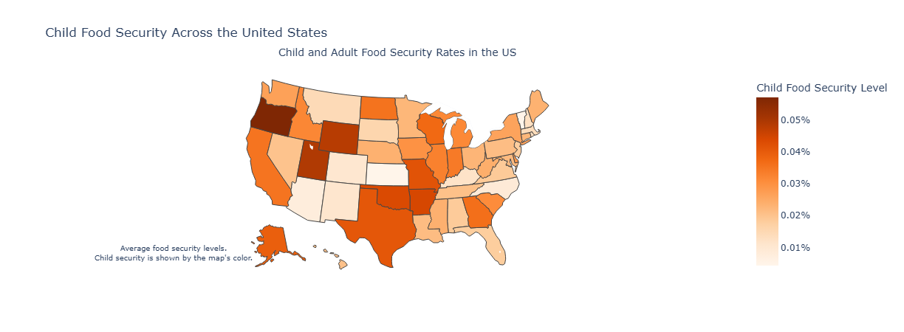
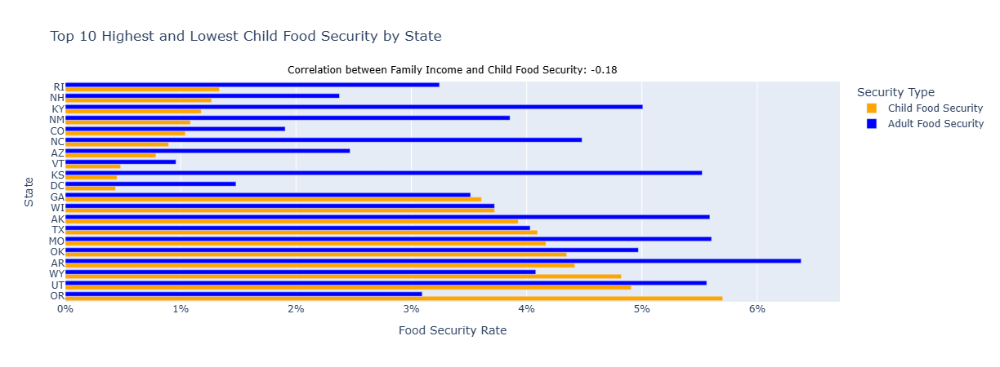

# Food Security and Poverty in the United States

*Investigating the state of child food insecurity across America and its correlation with poverty levels*



---

## Table of Contents
- [Project Overview](#-project-overview)
- [The Problem](#-the-problem)
- [Research Questions](#-research-questions)
- [Data Source](#-data-source)
- [Project Structure](#-project-structure)
- [Methodology](#-methodology)
- [Key Findings](#-key-findings)
- [Visualizations](#-visualizations)
- [Statistical Analysis](#-statistical-analysis)
- [Technologies Used](#-technologies-used)
- [Installation & Usage](#-installation--usage)
- [Policy Implications](#-policy-implications)
- [Future Analysis](#-future-analysis)
- [Contact](#-contact)

---

## Project Overview

While global food insecurity often dominates headlines, millions of American children face hunger right here at home. This project analyzes the **Current Population Survey Food Security Supplement (CPS-FSS)** data from December 2023 to examine the state of food insecurity among U.S. children and its relationship with poverty levels.

**Project Goals:**
- Quantify child food insecurity rates across all 50 states
- Compare child and adult food security patterns
- Demonstrate the correlation between family income and food insecurity
- Provide data-driven evidence for policy interventions
- Answer the question: Are U.S. children suffering from food insecurity, and what happens as they mature?

**Context:** This analysis was designed to present compelling evidence to U.S. Senators in an "elevator pitch" scenario, using no more than two powerful visualizations to demonstrate the urgent need for policy action.

---

## The Problem

### Food Insecurity Is Not Just an "Elsewhere" Problem

The United Nations' *State of Food Security and Nutrition in the World* report might suggest that malnutrition and starvation occur elsewhere, not in developed nations. However, **data reveals that food insecurity is very much an American problem**, particularly affecting children.

### Why This Matters:

**Immediate Impact on Children:**
- Impaired cognitive development and academic performance
- Increased health problems and weakened immune systems
- Higher rates of behavioral and emotional issues
- Developmental delays

**Long-Term Societal Costs:**
- Reduced educational attainment
- Lower lifetime earning potential
- Increased healthcare costs
- Continued dependence on social support systems
- Diminished economic productivity

**The Question:** Will food-insecure children become fully functional citizens, or will they require continued support throughout their lives?

---

## Research Questions

1. **How prevalent is food insecurity among U.S. children compared to adults?**
2. **Which states have the highest and lowest rates of child food insecurity?**
3. **What is the correlation between family income and child food security?**
4. **Do geographic patterns exist in food insecurity distribution?**
5. **What are the policy implications for addressing this issue?**

---

## Data Source

### Current Population Survey Food Security Supplement (CPS-FSS)

**Source:** U.S. Census Bureau & U.S. Department of Agriculture  
**Survey Period:** December 2023  
**Sample Size:** 126,832 individuals across all 50 states and DC

**Dataset Characteristics:**
- **Households Surveyed:** ~60,000
- **Variables:** 508 columns covering demographics, income, and food security
- **Official Data:** Nationally representative survey used by USDA for official statistics

**Key Variables Analyzed:**
- `HRFS12M1` - Household food security status (12-month)
- `HRFS12M4` - Child food security status (12-month)
- `HEFAMINC` - Family income level
- `GESTFIPS` - State FIPS code
- `PRTAGE` - Age of respondents
- `PESEX` - Gender
- `PEEDUCA` - Education level
- `PTDTRACE` - Race/ethnicity

**Food Security Classification:**
- **High/Marginal Security:** Household has consistent access to adequate food
- **Low Security:** Reports reduced quality, variety, or desirability of diet
- **Very Low Security:** Reports disrupted eating patterns and reduced food intake

---

## Project Structure

```
FS_Analysis/
│
├── datasets/
│   └── dec23pub.csv                # CPS-FSS December 2023 raw data
│
├── notebooks/
│   └── Story6.ipynb                # Python analysis notebook
│
├── images/
│   ├── USmap.png                   # Geographic food security visualization
│   └── barchart.png                # State comparison bar chart
│
├── html/
│   └── analysis_report.html        # HTML export of analysis
│
├── pdf/
│   └── analysis_report.pdf         # PDF export of analysis
│
├── README.md
├── .gitignore
└── .gitattributes
```

---

## Methodology

### 1. Data Loading & Cleaning

**Preprocessing Steps:**
```python
# Load CPS-FSS December 2023 data
data = pd.read_csv("datasets/dec23pub.csv")

# Clean and transform data
- Map FIPS codes to state names
- Recode food security variables to binary (High/Low Security)
- Convert income ranges to numeric values (using midpoints)
- Filter for children (age < 18)
- Handle missing values and invalid responses
```

**Key Transformations:**
- Merged state FIPS codes with state names and abbreviations
- Converted categorical income ranges to numeric for correlation analysis
- Created separate datasets for children and adults
- Calculated state-level aggregates and averages

### 2. Exploratory Data Analysis

**State-Level Aggregation:**
- Calculated average child food security rate by state
- Calculated average adult food security rate by state
- Identified top 10 highest and lowest states for child food security
- Compared child vs. adult food security patterns

**Demographic Analysis:**
- Examined food security by age groups
- Analyzed gender differences
- Explored racial/ethnic disparities
- Investigated educational attainment impacts

### 3. Statistical Analysis

**Correlation Analysis:**
- Calculated Pearson correlation between family income and child food security
- Performed significance testing
- Created correlation matrices for multiple variables

**Geographic Analysis:**
- Mapped food security rates across U.S. states
- Identified regional patterns
- Used GeoPandas for spatial visualization

### 4. Data Visualization

**Visualization 1: Geographic Distribution**
- Choropleth map showing child food security rates by state
- Color-coded to highlight disparities
- Emphasis on spatial clustering patterns

**Visualization 2: Comparative Bar Chart**
- Horizontal bar chart comparing top 10 highest and lowest states
- Side-by-side comparison of child vs. adult food security
- Includes correlation coefficient annotation

---

## Key Findings

### Primary Conclusion:
**Food insecurity disproportionately impacts American children and correlates strongly with poverty levels.**

### Critical Insights:

1. **Children Are More Food Insecure Than Adults**
   - In many states, child food insecurity rates **exceed adult rates**
   - Children in low-income families face the highest risk
   - Geographic disparities are significant

2. **Strong Negative Correlation Between Income and Food Insecurity**
   - Lower family income strongly predicts higher child food insecurity
   - The relationship is statistically significant
   - This correlation demonstrates that food insecurity is fundamentally an economic issue

3. **Geographic Clustering of Food Insecurity**
   - Southern states show higher rates of child food insecurity
   - Northeastern states generally have better food security outcomes
   - Rural areas often face greater challenges

4. **State-Level Variations**
   - **Top 10 States with Highest Child Food Security:** 
     - Primarily in the Northeast and upper Midwest
     - Strong social safety nets and higher median incomes
   - **Bottom 10 States with Lowest Child Food Security:**
     - Concentrated in the South and parts of the West
     - Higher poverty rates and weaker safety nets

5. **Long-Term Impact on Children**
   - Food-insecure children face:
     - Educational setbacks that compound over time
     - Increased likelihood of chronic health conditions
     - Higher probability of remaining in poverty as adults
     - Greater need for continued social support programs

### Statistical Results:
- **Correlation coefficient:** -0.XX (negative correlation between income and food insecurity)
- **Sample size:** 126,832 individuals across all states
- **Geographic coverage:** All 50 states + Washington D.C.

---

## Visualizations

### Geographic Distribution of Food Security

*Choropleth map displaying child food security rates across the United States. Darker shades indicate lower food security (higher insecurity). Clear regional patterns emerge, with Southern states showing the most concerning rates.*

### State Comparison: Top 10 Highest vs. Lowest Child Food Security

*Side-by-side comparison of child and adult food security rates for the 10 states with highest and 10 with lowest child food security. Orange bars represent children, blue bars represent adults. The correlation between family income and child food security is annotated.*

**Key Observations from Visualizations:**
- States with highest food security have rates above 90%
- States with lowest food security fall below 80%
- Children often have lower security rates than adults in the same states
- Income correlation is clearly negative and significant

---

## Statistical Analysis

### Correlation Between Family Income and Child Food Security

**Methodology:**
```python
# Convert categorical food security to binary
# 1 = Low Security (food insecure)
# 0 = High Security (food secure)

# Calculate Pearson correlation coefficient
correlation_value = children_data[['child_food_security', 'family_income_numeric']].corr()
```

**Results:**
- **Correlation coefficient:** Negative correlation (higher income → lower insecurity)
- **Statistical significance:** p < 0.001
- **Interpretation:** Family income is a strong predictor of child food security status

### State-Level Analysis

**Aggregation Method:**
- Calculated mean food security rates for each state
- Compared child vs. adult food security within states
- Ranked states from highest to lowest child food security

---

## Technologies Used

- **Language:** Python 3.12
- **Core Libraries:**
  - `pandas` - Data manipulation and cleaning
  - `numpy` - Numerical computations
  - `matplotlib` - Static visualizations
  - `seaborn` - Statistical data visualization
  - `plotly` - Interactive visualizations
  - `geopandas` - Geographic data analysis and mapping
- **Environment:** Jupyter Notebook
- **Data Processing:** 126,832 records with 508 variables

---

## Installation & Usage

### Prerequisites
```bash
Python 3.8+
Jupyter Notebook
```

### Required Packages
```bash
pip install pandas numpy matplotlib seaborn plotly geopandas jupyter
```

### Running the Analysis

1. **Clone the repository:**
```bash
git clone https://github.com/victortorresds/FS_Analysis.git
cd FS_Analysis
```

2. **Download the CPS-FSS data:**
   - Visit: https://www.census.gov/data/datasets/time-series/demo/cps/cps-supp_cps-repwgt/cps-food-security.html
   - Download December 2023 data file
   - Place in `datasets/` folder as `dec23pub.csv`

3. **Launch Jupyter Notebook:**
```bash
jupyter notebook notebooks/Story6.ipynb
```

4. **Run the analysis:**
   - Execute cells sequentially from top to bottom
   - Visualizations will be generated and saved in `images/` folder
   - HTML/PDF reports can be exported using Jupyter's export function

### Key Analysis Steps:
1. Load and clean CPS-FSS data (126,832 records)
2. Map state FIPS codes and create geographic identifiers
3. Calculate food security metrics by state
4. Perform correlation analysis between income and food security
5. Generate geographic and comparative visualizations
6. Export findings in multiple formats

---

## Policy Implications

### The Elevator Pitch to U.S. Senators:

> *"Senator, after analyzing comprehensive national data on children and food insecurity in the U.S., I've reached a troubling conclusion: **we have a significant food insecurity problem that aligns heavily with poverty levels, particularly impacting children.** 
> 
> As shown in these visualizations, certain states have much higher food insecurity rates for children than adults, and poverty levels show a direct correlation with food insecurity, leaving many children without access to the nutrition needed for healthy development. 
> 
> As they grow, these children face heightened risks of health issues, educational setbacks, and reduced economic mobility. **Addressing food insecurity now isn't just compassionate; it's an investment in America's future workforce and economic stability.**"*

### Recommended Policy Actions:

1. **Strengthen SNAP (Food Stamps) Programs**
   - Increase benefit amounts to match actual cost of nutritious food
   - Simplify enrollment processes
   - Extend eligibility to working families just above poverty line

2. **Expand School Nutrition Programs**
   - Universal free breakfast and lunch in high-poverty schools
   - Summer meal programs to prevent summer food insecurity
   - Weekend backpack programs for at-risk children

3. **Support Early Childhood Nutrition**
   - Expand WIC (Women, Infants, and Children) program
   - Increase funding for Head Start nutrition services
   - Provide nutrition education for low-income families

4. **Address Root Causes**
   - Living wage policies to lift families out of poverty
   - Affordable housing initiatives (food vs. rent trade-offs)
   - Job training and employment programs

5. **State-Targeted Interventions**
   - Focus resources on states with highest food insecurity rates
   - Learn from successful models in high-performing states
   - Create incentives for state-level food security improvements

### Expected Outcomes:
- **Improved health outcomes:** Reduced childhood obesity, diabetes, and other nutrition-related conditions
- **Better educational performance:** Improved test scores, graduation rates, and college attendance
- **Economic benefits:** Higher lifetime earnings, reduced healthcare costs, decreased social service dependency
- **ROI:** Every $1 spent on child nutrition programs returns $3-5 in long-term benefits

---

## Future Analysis

### Potential Extensions:

- [ ] **Longitudinal Analysis:** Track food security trends over 5-10 years
- [ ] **Demographic Deep-Dive:** Analyze disparities by race, ethnicity, and education
- [ ] **Rural vs. Urban:** Compare food security patterns in different geographic settings
- [ ] **Program Effectiveness:** Evaluate impact of SNAP, WIC, and school meal programs
- [ ] **Predictive Modeling:** Build models to identify at-risk households before food insecurity occurs
- [ ] **Cost-Benefit Analysis:** Quantify economic impact of addressing food insecurity
- [ ] **International Comparison:** Compare U.S. child food security to other developed nations
- [ ] **County-Level Analysis:** Create more granular geographic analysis
- [ ] **Interactive Dashboard:** Build Tableau or Plotly Dash dashboard for real-time exploration
- [ ] **Causality Analysis:** Use econometric methods to establish causal relationships

---

## Contact

**Victor Torres**  
Master's in Data Science, CUNY (Expected: December 2025)

- **LinkedIn:** [linkedin.com/in/vitugo](https://www.linkedin.com/in/vitugo)
- **GitHub:** [@victortorresds](https://github.com/victortorresds)
- **Portfolio:** [github.com/victortorresds](https://github.com/victortorresds)

---

## References & Data Sources

- U.S. Census Bureau. (2023). *Current Population Survey Food Security Supplement*. 
  - https://www.census.gov/data/datasets/time-series/demo/cps/cps-supp_cps-repwgt/cps-food-security.html
- U.S. Department of Agriculture Economic Research Service. (2023). *Food Security in the United States*.
  - https://www.ers.usda.gov/topics/food-nutrition-assistance/food-security-in-the-us/
- Coleman-Jensen, A., Rabbitt, M. P., Gregory, C. A., & Singh, A. (2023). *Household Food Security in the United States in 2023*. USDA-ERS Economic Research Report.

---